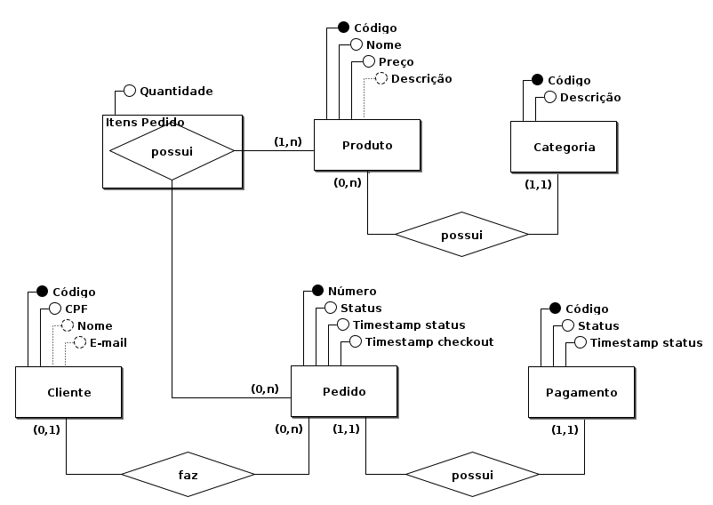

# Tech Challenge - Fase 3

Projeto realizado como atividade avaliativa do curso de **Software Architecture - Pós-Tech - FIAP**.

Link do projeto no GitHub:

- Aplicação: https://github.com/efrancodelima/application
- Infra kubernetes: https://github.com/efrancodelima/infra-k8s
- Infra do banco de dados: https://github.com/efrancodelima/infra-bd
- Function AWS Lambda: https://github.com/efrancodelima/lambda

# Índice

- [Objetivos](#objetivos)
- [Requisitos](#requisitos)
  - [Aplicação](#aplicacao)
  - [Arquitetura](#arquitetura)
  - [Pipeline](#pipeline)
- [Banco de dados](#banco-de-dados)
  - [Escolha e justificativa](#escolha-e-justificativa)
  - [Documentação](#documentacao)
    - [Modelo conceitual](#modelo-conceitual)
    - [Modelo lógico](#modelo-logico)

## Objetivos

Desenvolver um sistema para uma lanchonete local em fase de expansão. O sistema deverá realizar o controle dos pedidos, além de outras funções correlatas, conforme especificado no Tech Challenge.

## Requisitos

### Aplicação

A aplicação deverá oferecer a seguinte API web para consumo:

Cliente

- Cadastrar cliente
- Buscar cliente pelo CPF

Produto:

- Criar, editar e remover produtos
- Buscar produtos por categoria

Pedido

- Fazer checkout
- Deverá retornar a identificação do pedido
- Atualizar o status do pedido
- Consultar o status do pagamento
- Listar pedidos nessa ordem: Pronto > Em Preparação > Recebido
- Pedidos mais antigos primeiro e mais novos depois.
- Pedidos finalizados não devem aparecer na lista.

### Arquitetura

Arquitetura do software: utilizar a Clean Architecture.

Arquitetura da infra: utilizar o kubernetes para rodar a aplicação, que deverá rodar na nuvem utilizando os serviços serverless.
O banco de dados do projeto deverá ser uma solução oferecida pela nuvem escolhida.

### Pipeline

O projeto foi dividido em 4 partes:

- uma função lambda para a autenticação do usuário
- uma aplicação com as regras de negócio
- a infraestrutura kubernetes para a aplicação
- a infraestrutura para o banco de dados

Cada parte tem um repositório separado no GitHub, conforme mencionado no início deste documento, e todos os repositórios necessitam pull request para realizar qualquer tipo de alteração na branch main. As branchs main/master devem estar protegidas de forma a não permitir commits diretos.

Cada repositório deverá acionar o respectivo pipeline sempre que a branch main for alterada, realizando o deploy na nuvem escolhida.

## Banco de dados

### Escolha e justificativa

Escolhemos trabalhar com o modelo relacional, principalmente pela consistência e integridade dos dados, características fundamentais para um controle preciso dos pedidos e dos pagamentos da lanchonete.

Outra vantagem do modelo relacional é a sua maturidade: o modelo foi proposto em 1970 por Edgar F. Codd e desde então passou por diversas melhorias. Por estar há bastante tempo no mercado, é o modelo mais conhecido pelos profissionais de TI, sendo mais fácil encontrar mão de obra especializada para suporte e manutenção.

O SGBD escolhido foi o Amazon Aurora (engine MySQL). Como a aplicação também está rodando na nuvem da AWS, vamos aproveitar a sinergia de usar um pacote de soluções do mesmo desenvolvedor. O Aurora possui desempenho suficiente para atender às necessidades do projeto, oferece escalabilidade sob demanda (cobrando apenas pelo que foi usado), alta disponibilidade, gerenciamento automático de instâncias, backups automáticos, cache de dados em memória RAM (InnoDB Buffer Pool) e diversas outras ferramentas que funcionam de forma transparente ao profissional de TI, diminuindo muito a carga de trabalho do administrador do banco de dados.

### Documentação

#### Modelo conceitual

Utilizamos o Diagrama Entidade Relacionamento (DER) para representar o modelo conceitual do nosso banco de dados.

Esse diagrama está mais próximo da visão do usuário do sistema e mais distante da implementação de fato (modelo físico).

O diagrama abaixo foi feito utilizando o software brModelo.

Alguns pontos a destacar nesse diagrama:

- um pedido pode não ter um cliente (cliente não se identifica), por isso a cardinalidade mínima do lado cliente é zero;
- nome e e-mail do cliente são atributos opcionais, mas, pelo menos, um deles precisa ser preenchido. O brModelo não tem uma funcionalidade específica para anotar esse tipo de situação: "os campos podem ser nulos, mas não ambos";
- o brModelo também não tem a opção de linha dupla para as entidades com participação obrigatória no relacionamento, mas isso pode ser facilmente deduzido pela cardinalidade;
- o timestamp do checkout poderia ser um atributo opcional, indicando, quando ausente, que o checkout não foi realizado. No nosso caso, como o pedido só é gravado no banco de dados quando o cliente faz o checkout, faz mais sentido deixá-lo como atributo obrigatório mesmo;
- na entidade Pedido, o timestamp do status e o timestamp do checkout podem ser usados para acompanhar o tempo de espera do pedido. Poderíamos também ter feito uma entidade "Histórico do pedido" registrando o avanço do pedido em cada etapa. Tem várias formas de modelar uma solução, nós optamos pela forma mais simples dentre aquelas que atendem aos requisitos do projeto;
- Categoria do produto, pagamento do pedido e status do pedido: os três poderiam ser atributos ou entidades. A definição do que é uma entidade e do que é um atributo varia muito segundo a visão de quem modela, mas observando que "o modelo conceitual deve ser estar próximo da visão do usuário", escolhi deixar apenas o status do pedido como atributo.

#### Modelo lógico

No modelo lógico utilizamos a notação de Chen, também conhecida como "notação pé de galinha".

O diagrama abaixo foi criado com o MySQL BenchMark.

As principais mudanças são:

- a entidade Categoria do modelo anterior virou um campo do tipo "enum". Como temos poucas categorias, o enum permite ter um ganho de desempenho nas consultas e escritas do banco de dados, além de simplificar o esquema.
- a entidade Pagamento foi incorporada pela entidade pedido. Como o relacionamento era 1 para 1, não faz sentido ter tabelas separadas.

Na tabela "itens_pedido" a chave primária é composta pelas chaves primárias de pedido e produto, por isso as chaves aparecem em vermelho.
